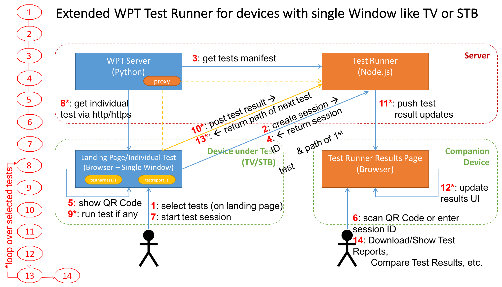

The Web Media API Test Suite 2018
========================================

The Web Media API Snapshot Test Suite 2018 (WMATS2018) is a test suite for 
the [Web Media API Snapshot 2018](https://www.w3.org/2018/12/webmediaapi.html) specification.
The test suite and specification are being developed as part of
the [CTA WAVE Project](http://cta.tech/WAVE).

This project is forked from
[W3C Web Platform Tests](https://github.com/web-platform-tests/wpt) and is customized
to automate test runs on web browsers for embedded devices and appliances suchs as TV sets,
set-top boxes, consoles, etc.

A hosted version is available at: https://webapitests2018.ctawave.org


Test server
===========

## Architecture


WMATS2018 extends the WPT Runner in a way that only a single 
window is required to run the tests. The Test Runner itself is migrated to a 
Node.js Server. The embedded device runs individual tests and sends the results
to the Node.js Test Runner via XHR, which update the internal state of the running 
test session and pushes the new updates to a companion page which shows the progress
of a test session (The Companion Page offers also other helpful features like 
generating test reports, exporting test results, compare test sessions, etc. 
through an easy to use interface). Once a Test is completed, the Node.js Test 
Runner sends the URL of the next test which will be opened in the same browser
window and the steps will be repeated until all tests are completed. The WPT test
files are included without any changes.

## Setup

Requirements:

* Python 2.7+ (but not Python 3.x)
* Node.js 8.x.x (LTS recommended)
* Git 2.4+ (should support sparse checkout)
* Bash script support (on windows we recommend Git BASH)

Generate hosts file:
```
$ ./wpt make-hosts-file | sudo tee -a /etc/hosts
```
on Windows:
```
$ python wpt make-hosts-file | Out-File %SystemRoot%\System32\drivers\etc\hosts -Encoding ascii -Append
```
Download test files according to WMAS2018 specification, call from WPT root directory:
```
$ ./wmas2018-subset.sh
```
[]([url](url))
To download the test results of the four reference browsers (Chromium, Firefox, Safari, Edge):
```
$ ./download-reference-results
```

Start Web Platform Test runner:
```
$ ./wpt serve-wave
```

Open in Web browser (on the same host):
```
http://web-platform.test:8050
```

## Remote Server
If you are planning to host the server on a different device than the DUT, 
make sure to replace 120.0.0.1 with your server IP and web-platform.test 
with your domain name in ```/etc/hosts```.

## Configuration
The default configuration is loaded from the ```config.default.json```
in the root directory. Configurations from the ```config.json```
in the same format as the ```config.default.json```override those.

Provide a different location with ```--config < path_to_config >``` as a
start parameter.

## Test Run Parameters
It is possible to parameterize a test run with various query parameters
provided with the query in the url of the initial request.

Example:
```
web-platform.test:8050/?path=/2dcontext&types=testharness
```

### Query Parameters
Parameter|Description|Example
------|------|------
`path`|Specify tests to run. Can be directory or file. Multiple paths can be chained by using `, `. Paths with leading '/' are interpreted as absolute paths, paths without as regular expressions. (Default: ```/```)|```web-platform.test:8050/?path=/2dcontext```
types|What types of tests to run. Possible types: ```testharness```, ```manual``` and ```reftest``` (Default: ```testharness```. Please note that including ```manual``` or ```reftest``` might lead to unexpected behaviour on embedded devices. It is recommended to only use ```testharness``` for automated test runs)|```web-platform.test:8050/?types=testharness,manual```
`timeout`|Specify a server side timeout in ms after which a test with no result is timed out|```web-platform.test:8050/?timeout=65000```
`token` and `resume` |Providing a token of an unfinished session will resume it.|```web-platform.test:8050/?token=2fb0fb80-63db-4425-8a76-2ea3e6f8269d&resume=1```

Certificates
============

By default pregenerated certificates for the web-platform.test domain
are provided in [`tools/certs`](tools/certs). If you wish to generate new
certificates for any reason it's possible to use OpenSSL when starting
the server, or starting a test run, by providing the
`--ssl-type=openssl` argument to the `wpt serve` or `wpt run`
commands.

If you installed OpenSSL in such a way that running `openssl` at a
command line doesn't work, you also need to adjust the path to the
OpenSSL binary. This can be done by adding a section to `config.json`
like:

```
"ssl": {"openssl": {"binary": "/path/to/openssl"}}
```

### Trusting Root CA

To prevent browser SSL warnings when running HTTPS tests locally, the
web-platform-tests Root CA file `cacert.pem` in [tools/certs](tools/certs)
must be added as a trusted certificate in your OS/browser.
