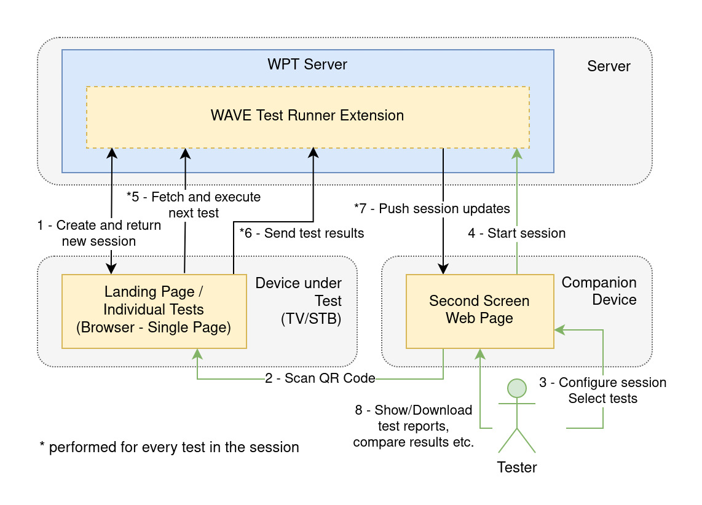

# The Web Media API Test Suite

The Web Media API Snapshot Test Suite (WMATS) is a test suite for
the [Web Media API Snapshot](https://www.w3.org/webmediaapi.html) specification.
The test suite and specification are being developed as part of
the [CTA WAVE Project](http://cta.tech/WAVE).

This project is forked from
[W3C Web Platform Tests](https://github.com/web-platform-tests/wpt) and is customized
to automate test runs on web browsers for embedded devices and appliances suchs as TV sets,
set-top boxes, consoles, etc.

This repository contains source code and tests of all WMAS Test Runner versions. See the table below for an overview of all important links for each version.

<table>
<thead>
<tr>
<th>version</th>
<th>spec</th>
<th>source branch</th>
<th>docker deploy</th>
<th>tests branch</th>
<th>docs</th>
</tr>
</thead>
<tbody>
<tr>
<th>WMAS 2023</th>
<td rowspan="2"><a href="https://www.w3.org/2023/11/webmediaapi.html" rel="nofollow">WMAS2023</a></td>
<td><a href="https://github.com/cta-wave/WMAS/tree/wmas2023">latest 2023 source</a></td>
<td><a href="https://github.com/cta-wave/WMAS-deploy/tree/wmas2023">latest 2023 deploy</a></td>
<td rowspan="2"><a href="https://github.com/cta-wave/WMAS/tree/wmas2023-tests">2023 tests</a></td>
<td rowspan="2"><a href="https://github.com/cta-wave/WMAS/tree/wmas2023/tools/wave/docs">2023 docs</a></td>
</tr>
<tr>
<td>WMAS 2023 v1.0.0</td>
<td><a href="https://github.com/cta-wave/WMAS/releases/tag/wmas2023-v1.0.0">wmas2023-v1.0.0</a></td>
<td><a href="https://github.com/cta-wave/WMAS-deploy/releases/tag/wmas2023-v1.0.0">wmas2023-deploy-v1.0.0</a></td>
</tr>
<tr>
<th>WMAS 2022</th>
<td rowspan="2"><a href="https://www.w3.org/2022/12/webmediaapi.html" rel="nofollow">WMAS2022</a></td>
<td><a href="https://github.com/cta-wave/WMAS/tree/wmas2022">latest 2022 source</a></td>
<td><a href="https://github.com/cta-wave/WMAS-deploy/tree/wmas2022">latest 2022 deploy</a></td>
<td rowspan="2"><a href="https://github.com/cta-wave/WMAS/tree/wmas2022-tests">2022 tests</a></td>
<td rowspan="2"><a href="https://github.com/cta-wave/WMAS/tree/wmas2022/tools/wave/docs">2022 docs</a></td>
</tr>
<tr>
<td>WMAS 2022 v1.0.0</td>
<td><a href="https://github.com/cta-wave/WMAS/releases/tag/wmas2022-v1.0.0">wmas2022-v1.0.0</a></td>
<td><a href="https://github.com/cta-wave/WMAS-deploy/releases/tag/wmas2022-v1.0.0">wmas2022-deploy-v1.0.0</a></td>
</tr>
<tr>
<th>WMAS 2021</th>
<td rowspan="2"><a href="https://www.w3.org/2021/12/webmediaapi.html" rel="nofollow">WMAS2021</a></td>
<td><a href="https://github.com/cta-wave/WMAS/tree/wmas2021">latest 2021 source</a></td>
<td><a href="https://github.com/cta-wave/WMAS-deploy/tree/wmas2021">latest 2021 deploy</a></td>
<td rowspan="2"><a href="https://github.com/cta-wave/WMAS/tree/wmas2021-tests">2021 tests</a></td>
<td rowspan="2"><a href="https://github.com/cta-wave/WMAS/tree/wmas2021/tools/wave/docs">2021 docs</a></td>
</tr>
<tr>
<td>WMAS 2021 v1.0.0</td>
<td><a href="https://github.com/cta-wave/WMAS/releases/tag/wmas2021-v1.0.0">wmas2021-v1.0.0</a></td>
<td><a href="https://github.com/cta-wave/WMAS-deploy/releases/tag/wmas2021-v1.0.0">wmas2021-deploy-v1.0.0</a></td>
</tr>
<tr>
<th>WMAS 2020</th>
<td rowspan="3"><a href="https://www.w3.org/2020/12/webmediaapi.html" rel="nofollow">WMAS2020</a></td>
<td><a href="https://github.com/cta-wave/WMAS/tree/wmas2020">latest 2020 source</a></td>
<td><a href="https://github.com/cta-wave/WMAS-deploy/tree/wmas2020">latest 2020 deploy</a></td>
<td rowspan="3"><a href="https://github.com/cta-wave/WMAS/tree/wmas2020-tests">2020 tests</a></td>
<td rowspan="3"><a href="https://github.com/cta-wave/WMAS/tree/wmas2020/tools/wave/docs">2020 docs</a></td>
</tr>
<tr>
<td>WMAS 2020 v1.1.0</td>
<td><a href="https://github.com/cta-wave/WMAS/releases/tag/wmas2020-v1.1.0">wmas2020-v1.1.0</a></td>
<td><a href="https://github.com/cta-wave/WMAS-deploy/releases/tag/wmas2020-v1.1.0">wmas2020-deploy-v1.1.0</a></td>
</tr>
<tr>
<td>WMAS 2020 v1.0.0</td>
<td><a href="https://github.com/cta-wave/WMAS/releases/tag/wmas2020-v1.0.0">wmas2020-v1.0.0</a></td>
<td><a href="https://github.com/cta-wave/WMAS-deploy/releases/tag/wmas2020-v1.0.0">wmas2020-deploy-v1.0.0</a></td>
</tr>
<tr>
<th>WMAS 2019</th>
<td rowspan="3"><a href="https://www.w3.org/2019/12/webmediaapi.html" rel="nofollow">WMAS2019</a></td>
<td><a href="https://github.com/cta-wave/WMAS/tree/wmas2019">latest 2019 source</a></td>
<td><a href="https://github.com/cta-wave/WMAS-deploy/tree/wmas2019">latest 2019 deploy</a></td>
<td rowspan="3"><a href="https://github.com/cta-wave/WMAS/tree/wmas2019-tests">2019 tests</a></td>
<td rowspan="3"><a href="https://github.com/cta-wave/WMAS/tree/wmas2019/tools/wave/docs">2019 docs</a></td>
</tr>
<tr>
<td>WMAS 2019 v1.1.0</td>
<td><a href="https://github.com/cta-wave/WMAS/releases/tag/wmas2019-v1.1.0">wmas2019-v1.1.0</a></td>
<td><a href="https://github.com/cta-wave/WMAS-deploy/releases/tag/wmas2019-v1.1.0">wmas2019-deploy-v1.1.0</a></td>
</tr>
<tr>
<td>WMAS 2019 v1.0.0</td>
<td><a href="https://github.com/cta-wave/WMAS/releases/tag/wmas2019-v1.0.0">wmas2019-v1.0.0</a></td>
<td><a href="https://github.com/cta-wave/WMAS-deploy/releases/tag/wmas2019-v1.0.0">wmas2019-deploy-v1.0.0</a></td>
</tr>
<tr>
<tr>
<th>WMAS 2018</th>
<td rowspan="5"><a href="https://www.w3.org/2018/12/webmediaapi.html" rel="nofollow">WMAS2018</a></td>
<td><a href="https://github.com/cta-wave/WMAS/tree/wmas2018">latest 2018 source</a></td>
<td><a href="https://github.com/cta-wave/WMAS-deploy/tree/wmas2018">latest 2018 deploy</a></td>
<td rowspan="5"><a href="https://github.com/cta-wave/WMAS/tree/wmas2018-tests">2018 tests</a></td>
<td rowspan="5"><a href="https://github.com/cta-wave/WMAS/tree/wmas2018/tools/wave/docs">2018 docs</a></td>
</tr>
<tr>
<td>WMAS 2018 v1.1.0</td>
<td><a href="https://github.com/cta-wave/WMAS/releases/tag/wmas2018-v1.1.0">wmas2018-v1.1.0</a></td>
<td><a href="https://github.com/cta-wave/WMAS-deploy/releases/tag/wmas2018-v1.1.0">wmas2018-deploy-v1.1.0</a></td>
</tr>
<tr>
<td>WMAS 2018 v1.0.2</td>
<td><a href="https://github.com/cta-wave/WMAS/releases/tag/wmas2018-v1.0.2">wmas2018-v1.0.2</a></td>
<td><a href="https://github.com/cta-wave/WMAS-deploy/releases/tag/wmas2018-v1.0.2">wmas2018-deploy-v1.0.2</a></td>
</tr>
<tr>
<td>WMAS 2018 v1.0.1</td>
<td><a href="https://github.com/cta-wave/WMAS/releases/tag/wmas2018-v1.0.1">wmas2018-v1.0.1</a></td>
<td><a href="https://github.com/cta-wave/WMAS-deploy/releases/tag/wmas2018-v1.0.1">wmas2018-deploy-v1.0.1</a></td>
</tr>
<tr>
<td>WMAS 2018 v1.0.0</td>
<td><a href="https://github.com/cta-wave/WMAS/releases/tag/wmas2018-v1.0.0">wmas2018-v1.0.0</a></td>
<td><a href="https://github.com/cta-wave/WMAS-deploy/releases/tag/wmas2018-v1.0.0">wmas2018-deploy-v1.0.0</a></td>
</tr>
<tr>
<th>WMAS 2017</th>
<td><a href="https://www.w3.org/2017/12/webmediaapi.html" rel="nofollow">WMAS2017</a></td>
<td><a href="https://github.com/cta-wave/WMAS/tree/wmas2017">latest 2017 source</a></td>
<td>n/a</td>
<td><a href="https://github.com/cta-wave/WMAS/tree/wmas2017-tests">2017 tests</a></td>
<td><a href="https://github.com/cta-wave/WMAS/tree/wmas2017#setup">2017 docs</a></td>
</tr>
</tbody>
</table>

**Release Schedule as of 2024:** New tags are created on the 7th day of each quarter when updates have been made during the previous quarter. Tags for both the source and deploy codebases are kept in sync.

# Architecture

The WAVE Test Runner is an extension to the WPT server, that doesn't modify the original code. It allows to run tests in a single window and lets the tester monitor it from a second device, which makes it suiteable for embedded devices. The device under test fetches individual tests from the WAVE Test Runner to execute and sends the results back via XHR. The test runner updates the internal state of the running test session and pushes the new updates to a companion page which shows the progress of the test session (it also offers other helpful features like generating test reports, exporting test results, compare test sessions, etc. through an easy to use interface). Once a Test is completed, the WAVE Test Runner sends the URL of the next test which will be opened in the same browser window. This process will be repeated until all tests are completed.

# Deployment

The test runner is easily deployable using docker. See the corresponding links in the table above.
